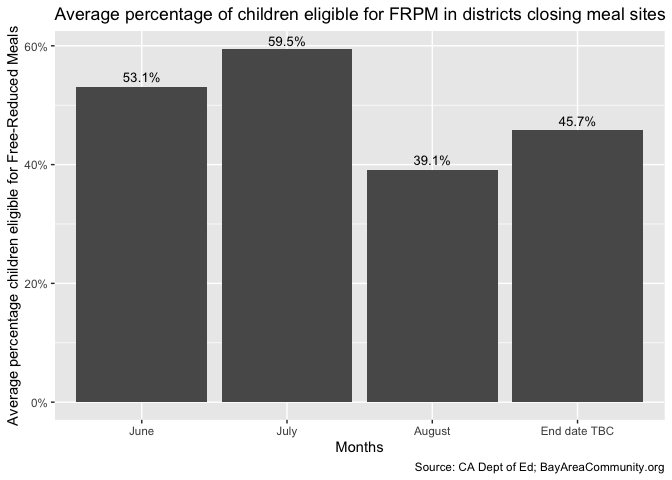
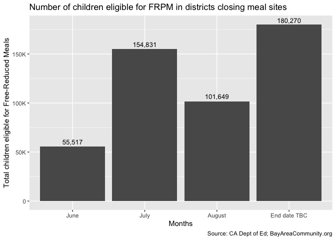
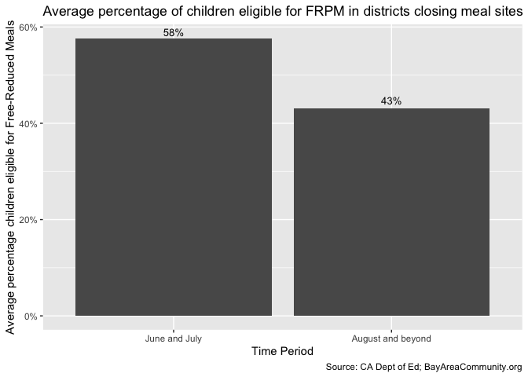

School\_meals\_report
================
Chris LeBoa & Joyce Tagal
2020-06-28

  - [Overview](#overview)
  - [Data sources and Assumptions](#data-sources-and-assumptions)
  - [Load Packages](#load-packages)
  - [Read in Data](#read-in-data)
  - [Cleaning data](#cleaning-data)
  - [Basic counts of schools still
    open](#basic-counts-of-schools-still-open)
      - [Schools PEBT information
        details](#schools-pebt-information-details)
      - [Schools ending summer
        distribution](#schools-ending-summer-distribution)
  - [Join with FRPM](#join-with-frpm)
      - [Clean district names](#clean-district-names)
      - [Checking for intersection between
        datasets](#checking-for-intersection-between-datasets)
  - [Averaging district population across school
    closures](#averaging-district-population-across-school-closures)
  - [Conclusion and GGPlot](#conclusion-and-ggplot)

## Overview

This document analyzes the number of students eligible for Free and
Reduced Price Meals (FRPM) that will be affected by Bay Area school meal
site closures over the summer period of June-August 2020. We find that
school districts closing in early months of the summer (June and July
2020) have a higher than average percentage (53%) of students who are
FRPM-eligible, compared to an average of 45% of FRPM across districts
which are closing post-July. In June and July 2020, the closing of
school sites will affect over 250,000 FRPM eligible students.

## Data sources and Assumptions

This document uses two main data sources:

  - [CA Dept of Ed](https://www.cde.ca.gov/ds/sd/sd/filessp.asp) Free
    and Reduced Price Meal data for school year 2019-20
  - [BayAreaCommunity.org](https://www.bayareacommunity.org/#/) school
    meal sites info, that has been updated on a weekly basis from March
    2020 to present.

In this analysis we make several assumptions:

  - Students and their families are most able to access meal sites
    within their school districts. This assumption may not hold for
    denser, urban areas where a student may access meal sites in a
    neighboring school district. However, given that a not-insignificant
    number of school districts only allow district students to access
    the school meals, this may hold on average.
  - In averaging numbers of FRPM students across a district, we take a
    simple average of FRPM students across schools within the district.
    This assumes an equal distribution of FRPM across schools, and a
    similar total enrollment across schools.

## Load Packages

## Read in Data

``` r
school_meals <- 
  read_sheet(
    ss = "1fea1BSSAhbSB0HLsatDaD8wxmwsF7ezQjNvjRK-QJQI", 
    skip = 1,
    col_types = "ccccccccccccccccccccccccccccccc"
  ) %>% 
  rename(
    "district_name" = provider_addloc,
    "site_name" = provider_name
  )
```

    ## Auto-refreshing stale OAuth token.

    ## Reading from "Bay Area School Meal Sites"

    ## Range "2:5000000"

``` r
school_meals
```

    ## # A tibble: 760 x 31
    ##    site_name address city  zip   lat   lon   district_name status pebt_info_yn
    ##    <chr>     <chr>   <chr> <chr> <chr> <chr> <chr>         <chr>  <chr>       
    ##  1 Junction… 298 Ju… Live… 94551 37.6… -121… Livermore Va… Open   1           
    ##  2 Marylin … 800 Ma… Live… 94551 37.6… -121… Livermore Va… Open   1           
    ##  3 Alameda … 677 W.… Alam… 94607 37.7… -122… Alameda Unif… Open   0           
    ##  4 Earheart… 400 Pa… Alam… 94502 37.7… -122… Alameda Unif… Open   0           
    ##  5 Wood Mid… 420 Gr… Alam… 94607 37.7… -122… Alameda Unif… Open   0           
    ##  6 College … 555 Ra… Alam… 94501 37.7… -122… Alameda Unif… Closed 0           
    ##  7 Albany H… 603 Ke… Alba… 94707 37.8… -122… Albany City … Open   0           
    ##  8 Berkeley… 2015 V… Berk… 94709 37.8… -122… Berkeley Uni… Closed 1           
    ##  9 Washingt… 2300 M… Berk… 94707 37.8… -122… Berkeley Uni… Open   1           
    ## 10 Rosa Par… 920 Al… Berk… 94710 37.8… -122… Berkeley Uni… Open   1           
    ## # … with 750 more rows, and 22 more variables: ebt_homepage <chr>,
    ## #   pebt_notes <chr>, contains_original_info <chr>, links_to_CDSS <chr>,
    ## #   links_to_cfa <chr>, open_hour <chr>, close_hour <chr>, notes <chr>,
    ## #   notes_es <chr>, days_of_week <chr>, county <chr>, phone <chr>, email <chr>,
    ## #   end_date <chr>, weblink <chr>, date_updated <chr>, date_verified <chr>,
    ## #   verified_by <chr>, meals_served <chr>, internal_notes <chr>,
    ## #   called_school_district <chr>, call_date <chr>

## Cleaning data

``` r
school_meals_months <- 
  school_meals %>% 
  filter(status == "Open") %>% 
  mutate(
    end_date = 
    case_when(
      str_detect(end_date, "June") == TRUE ~ "6/30",
      str_detect(end_date, "end of school year") == TRUE ~ NA_character_,
      str_detect(end_date, "06") == TRUE ~ "6/12", 
      TRUE ~ end_date
      ),
    end_month = 
      case_when(
      str_detect(end_date, "05/|5/") == TRUE ~ "End date TBC",
      str_detect(end_date, "06/|6/") == TRUE ~ "June", 
      str_detect(end_date, "07/|7/") == TRUE ~ "July",
      str_detect(end_date, "08/|8/") == TRUE ~ "August", 
      str_detect(end_date, "Until further notice") == TRUE ~ "End date TBC",
      is.na(end_date) == TRUE ~ "End date TBC", 
      TRUE ~ end_date
      )
  ) 

school_meals_months 
```

    ## # A tibble: 546 x 32
    ##    site_name address city  zip   lat   lon   district_name status pebt_info_yn
    ##    <chr>     <chr>   <chr> <chr> <chr> <chr> <chr>         <chr>  <chr>       
    ##  1 Junction… 298 Ju… Live… 94551 37.6… -121… Livermore Va… Open   1           
    ##  2 Marylin … 800 Ma… Live… 94551 37.6… -121… Livermore Va… Open   1           
    ##  3 Alameda … 677 W.… Alam… 94607 37.7… -122… Alameda Unif… Open   0           
    ##  4 Earheart… 400 Pa… Alam… 94502 37.7… -122… Alameda Unif… Open   0           
    ##  5 Wood Mid… 420 Gr… Alam… 94607 37.7… -122… Alameda Unif… Open   0           
    ##  6 Albany H… 603 Ke… Alba… 94707 37.8… -122… Albany City … Open   0           
    ##  7 Washingt… 2300 M… Berk… 94707 37.8… -122… Berkeley Uni… Open   1           
    ##  8 Rosa Par… 920 Al… Berk… 94710 37.8… -122… Berkeley Uni… Open   1           
    ##  9 Longfell… 1522 W… Berk… 95704 37.8… -122… Berkeley Uni… Open   1           
    ## 10 Berkeley… 1980 A… Berk… 94704 37.8… -122… Berkeley Uni… Open   1           
    ## # … with 536 more rows, and 23 more variables: ebt_homepage <chr>,
    ## #   pebt_notes <chr>, contains_original_info <chr>, links_to_CDSS <chr>,
    ## #   links_to_cfa <chr>, open_hour <chr>, close_hour <chr>, notes <chr>,
    ## #   notes_es <chr>, days_of_week <chr>, county <chr>, phone <chr>, email <chr>,
    ## #   end_date <chr>, weblink <chr>, date_updated <chr>, date_verified <chr>,
    ## #   verified_by <chr>, meals_served <chr>, internal_notes <chr>,
    ## #   called_school_district <chr>, call_date <chr>, end_month <chr>

## Basic counts of schools still open

``` r
school_meals %>% 
  filter(!is.na(status), status != "status") %>% 
  count(status)
```

    ## # A tibble: 3 x 2
    ##   status      n
    ##   <chr>   <int>
    ## 1 Closed    205
    ## 2 Open      546
    ## 3 Unclear     9

``` r
school_meals %>% 
  distinct(site_name)
```

    ## # A tibble: 738 x 1
    ##    site_name                      
    ##    <chr>                          
    ##  1 Junction Avenue K-8            
    ##  2 Marylin Avenue Elementary      
    ##  3 Alameda Point Collaborative    
    ##  4 Earheart Elementary School     
    ##  5 Wood Middle School             
    ##  6 College of Alameda             
    ##  7 Albany High School Cafeteria   
    ##  8 Berkeley Arts Magnet Elementary
    ##  9 Washington Elementary          
    ## 10 Rosa Parks Elementary          
    ## # … with 728 more rows

``` r
school_meals %>% 
  filter(!is.na(status)) %>% 
  distinct(district_name) #146 school districts 
```

    ## # A tibble: 144 x 1
    ##    district_name                 
    ##    <chr>                         
    ##  1 Livermore Valley Joint Unified
    ##  2 Alameda Unified               
    ##  3 Albany City Unified           
    ##  4 Berkeley Unified              
    ##  5 Castro Valley Unified         
    ##  6 Dublin Unified                
    ##  7 Emery Unified                 
    ##  8 Fremont Unified               
    ##  9 Hayward Unified               
    ## 10 New Haven Unified             
    ## # … with 134 more rows

### Schools PEBT information details

``` r
school_meals %>% 
  filter(!is.na(pebt_info_yn)) %>% 
  count(pebt_info_yn)
```

    ## # A tibble: 2 x 2
    ##   pebt_info_yn     n
    ##   <chr>        <int>
    ## 1 0              409
    ## 2 1              351

``` r
school_meals %>% 
  filter(pebt_info_yn == "1") %>% 
  distinct(pebt_notes)
```

    ## # A tibble: 55 x 1
    ##    pebt_notes                                                                   
    ##    <chr>                                                                        
    ##  1 https://www.livermoreschools.org/Page/8790                                   
    ##  2 https://www.berkeleyschools.net/2020/05/pandemic-ebt-information/            
    ##  3 https://www.cv.k12.ca.us/apps/pages/index.jsp?uREC_ID=1728675&type=d&pREC_ID…
    ##  4 https://www.dublin.k12.ca.us/site/default.aspx?PageType=3&DomainID=1&ModuleI…
    ##  5 http://emeryusd.k12.ca.us/wp-content/uploads/2020/05/Pandemic-EBT-Informatio…
    ##  6 https://haywardusd-ca.schoolloop.com/pf4/cms2/news_themed_display?id=1590054…
    ##  7 https://www.mynhusd.org/apps/news/article/1233836                            
    ##  8 https://twitter.com/nusdschoolnews                                           
    ##  9 https://4.files.edl.io/acea/05/19/20/175812-db1f27cc-de08-4cfa-863c-b57b0501…
    ## 10 0                                                                            
    ## # … with 45 more rows

``` r
school_meals %>% 
  filter(str_detect(pebt_notes, "Flyer|flyer|flier|app")) %>% 
  distinct(pebt_notes)
```

    ## # A tibble: 15 x 1
    ##    pebt_notes                                                                   
    ##    <chr>                                                                        
    ##  1 https://www.cv.k12.ca.us/apps/pages/index.jsp?uREC_ID=1728675&type=d&pREC_ID…
    ##  2 https://www.mynhusd.org/apps/news/article/1233836                            
    ##  3 Children who are eligible for free or reduced-price meals will get extra foo…
    ##  4 https://www.gfusd.net/apps/news/article/1233499                              
    ##  5 https://www.mpusd.net/apps/pages/index.jsp?uREC_ID=1012823&type=d&pREC_ID=13…
    ##  6 https://www.salinasuhsd.org/cms/lib/CA02208720/Centricity/Domain/799/pebt%20…
    ##  7 https://www.sfusd.edu/announcements/2020-06-08-extra-food-support-apply-p-eb…
    ##  8 https://www.lindenusd.com/apps/pages/index.jsp?uREC_ID=1155648&type=d&pREC_I…
    ##  9 https://www.lindenusd.com/apps/pages/index.jsp?uREC_ID=1155648&type=d&pREC_I…
    ## 10 https://www.lindenusd.com/apps/pages/index.jsp?uREC_ID=1155648&type=d&pREC_I…
    ## 11 https://www.lindenusd.com/apps/pages/index.jsp?uREC_ID=1155648&type=d&pREC_I…
    ## 12 https://www.lindenusd.com/apps/pages/index.jsp?uREC_ID=1155648&type=d&pREC_I…
    ## 13 https://www.ogsd.net/apps/pages/index.jsp?uREC_ID=586642&type=d&pREC_ID=1075…
    ## 14 https://sl.losd.ca/apps/pages/index.jsp?uREC_ID=1550422&type=d&pREC_ID=16765…
    ## 15 https://www.busd.org/cms/lib/CA50000110/Centricity/Domain/37/Pandemic%20EBT%…

``` r
school_meals %>% 
  filter(pebt_info_yn == "1") %>% 
  distinct(site_name)  #43 report 
```

    ## # A tibble: 347 x 1
    ##    site_name                           
    ##    <chr>                               
    ##  1 Junction Avenue K-8                 
    ##  2 Marylin Avenue Elementary           
    ##  3 Berkeley Arts Magnet Elementary     
    ##  4 Washington Elementary               
    ##  5 Rosa Parks Elementary               
    ##  6 Longfellow Middle School            
    ##  7 Berkeley High School                
    ##  8 Willard Middle School               
    ##  9 Martin Luther King Jr. Middle School
    ## 10 Castro Valley Elementary School     
    ## # … with 337 more rows

``` r
meals_pebt <- 
  school_meals %>% 
  filter(pebt_info_yn == "1") %>% 
  group_by(district_name) %>% 
  count(links_to_cfa, links_to_CDSS, contains_original_info, pebt_notes)

# meals_pebt %>% 
#   write_csv("/Users/ChrisLeBoa/Downloads/pebt_districts.csv")

meals_pebt %>% 
  mutate(
    links_to_cfa = as.numeric(links_to_cfa),
    links_to_CDSS = as.numeric(links_to_CDSS), 
    contains_original_info = as.numeric(contains_original_info)
    ) %>% 
  ungroup() %>% 
  summarise_at(c("links_to_cfa", "links_to_CDSS", "contains_original_info"), sum, na.rm = TRUE)
```

    ## # A tibble: 1 x 3
    ##   links_to_cfa links_to_CDSS contains_original_info
    ##          <dbl>         <dbl>                  <dbl>
    ## 1           48            12                     35

### Schools ending summer distribution

``` r
#Count months by school location

school_meals_months %>% 
  summarize(total_sites = n())
```

    ## # A tibble: 1 x 1
    ##   total_sites
    ##         <int>
    ## 1         546

``` r
school_meals_months %>% 
  summarize(total_districts = n_distinct(district_name))
```

    ## # A tibble: 1 x 1
    ##   total_districts
    ##             <int>
    ## 1             111

``` r
school_meals_months %>% 
  count(end_month) %>% 
  rename("no_schools" = n) %>% 
  mutate(pct_schools = no_schools * 100 / sum(no_schools))
```

    ## # A tibble: 4 x 3
    ##   end_month    no_schools pct_schools
    ##   <chr>             <int>       <dbl>
    ## 1 August               95        17.4
    ## 2 End date TBC        193        35.3
    ## 3 July                146        26.7
    ## 4 June                112        20.5

``` r
school_meals_months %>%
  group_by(end_month) %>% 
  count(district_name, name = "Number of Schools") %>% 
  count(end_month) %>% 
  rename("no_districts" = n)
```

    ## # A tibble: 4 x 2
    ## # Groups:   end_month [4]
    ##   end_month    no_districts
    ##   <chr>               <int>
    ## 1 August                 24
    ## 2 End date TBC           43
    ## 3 July                   24
    ## 4 June                   28

``` r
school_meals %>% 
  filter(county != "county") %>% 
  distinct(county)
```

    ## # A tibble: 15 x 1
    ##    county             
    ##    <chr>              
    ##  1 Alameda            
    ##  2 Contra Costa County
    ##  3 Marin              
    ##  4 Monterey           
    ##  5 Napa               
    ##  6 Sacramento         
    ##  7 San Benito County  
    ##  8 San Francisco      
    ##  9 San Joaquin        
    ## 10 San Mateo          
    ## 11 Santa Clara        
    ## 12 Santa Cruz         
    ## 13 Solano             
    ## 14 Sonoma             
    ## 15 Stanislaus

## Join with FRPM

``` r
frlink <- here::here("data/frpm1920.xlsx")

frpm <- 
  readxl::read_xlsx(frlink, sheet = 2, skip = 1) %>% 
  rename_all(.funs = ~str_to_lower(.) %>% str_replace_all(., " ", "_") %>% str_replace_all(., "[()\\n//-]", "") %>% str_replace(., "%", "pct"))

frpm %>% 
  summarize(sum = sum(frpm_count_k12))
```

    ## # A tibble: 1 x 1
    ##       sum
    ##     <dbl>
    ## 1 3654943

``` r
frpm %>% 
  distinct(district_type)
```

    ## # A tibble: 8 x 1
    ##   district_type                   
    ##   <chr>                           
    ## 1 County Office of Education (COE)
    ## 2 State Special Schools           
    ## 3 Unified School District         
    ## 4 Elementary School District      
    ## 5 State Board of Education        
    ## 6 High School District            
    ## 7 Non-School Locations            
    ## 8 Statewide Benefit Charter

``` r
frpm %>% 
  distinct(district_name)
```

    ## # A tibble: 1,023 x 1
    ##    district_name                                              
    ##    <chr>                                                      
    ##  1 Alameda County Office of Education                         
    ##  2 California School for the Blind (State Special Schl)       
    ##  3 California School for the Deaf-Fremont (State Special Schl)
    ##  4 Alameda Unified                                            
    ##  5 Albany City Unified                                        
    ##  6 Berkeley Unified                                           
    ##  7 Castro Valley Unified                                      
    ##  8 Emery Unified                                              
    ##  9 Fremont Unified                                            
    ## 10 Hayward Unified                                            
    ## # … with 1,013 more rows

### Clean district names

``` r
school_meals_clean <- 
  school_meals_months %>% 
  filter(
    !district_name %in% 
      c("YMCA Silicon Valley", 
        "San Mateo County Library",
        "Voices College Bound",
        "Ace Charter Schools",
        "Alpha Public Schools",
        "Downtown College Prep",
        "Summit Public Schools",
        "Rocketship Public Schools"
      )
  )

school_meals_clean
```

    ## # A tibble: 504 x 32
    ##    site_name address city  zip   lat   lon   district_name status pebt_info_yn
    ##    <chr>     <chr>   <chr> <chr> <chr> <chr> <chr>         <chr>  <chr>       
    ##  1 Junction… 298 Ju… Live… 94551 37.6… -121… Livermore Va… Open   1           
    ##  2 Marylin … 800 Ma… Live… 94551 37.6… -121… Livermore Va… Open   1           
    ##  3 Alameda … 677 W.… Alam… 94607 37.7… -122… Alameda Unif… Open   0           
    ##  4 Earheart… 400 Pa… Alam… 94502 37.7… -122… Alameda Unif… Open   0           
    ##  5 Wood Mid… 420 Gr… Alam… 94607 37.7… -122… Alameda Unif… Open   0           
    ##  6 Albany H… 603 Ke… Alba… 94707 37.8… -122… Albany City … Open   0           
    ##  7 Washingt… 2300 M… Berk… 94707 37.8… -122… Berkeley Uni… Open   1           
    ##  8 Rosa Par… 920 Al… Berk… 94710 37.8… -122… Berkeley Uni… Open   1           
    ##  9 Longfell… 1522 W… Berk… 95704 37.8… -122… Berkeley Uni… Open   1           
    ## 10 Berkeley… 1980 A… Berk… 94704 37.8… -122… Berkeley Uni… Open   1           
    ## # … with 494 more rows, and 23 more variables: ebt_homepage <chr>,
    ## #   pebt_notes <chr>, contains_original_info <chr>, links_to_CDSS <chr>,
    ## #   links_to_cfa <chr>, open_hour <chr>, close_hour <chr>, notes <chr>,
    ## #   notes_es <chr>, days_of_week <chr>, county <chr>, phone <chr>, email <chr>,
    ## #   end_date <chr>, weblink <chr>, date_updated <chr>, date_verified <chr>,
    ## #   verified_by <chr>, meals_served <chr>, internal_notes <chr>,
    ## #   called_school_district <chr>, call_date <chr>, end_month <chr>

### Checking for intersection between datasets

``` r
intersect(
  school_meals_clean %>% 
  distinct(district_name),
  frpm %>% 
  distinct(district_name)
)
```

    ## # A tibble: 103 x 1
    ##    district_name                 
    ##    <chr>                         
    ##  1 Livermore Valley Joint Unified
    ##  2 Alameda Unified               
    ##  3 Albany City Unified           
    ##  4 Berkeley Unified              
    ##  5 Dublin Unified                
    ##  6 Emery Unified                 
    ##  7 Fremont Unified               
    ##  8 Hayward Unified               
    ##  9 New Haven Unified             
    ## 10 Newark Unified                
    ## # … with 93 more rows

``` r
districts <- school_meals_clean %>% distinct(district_name) %>% pull()

frpm_districts <- 
  frpm %>% 
  filter(district_name %in% districts) %>% 
  select(
    academic_year, 
    county_name, 
    district_name, 
    enrollment_k12, 
    free_meal_count_k12,
    percent_pct_eligible_free_k12,
    frpm_count_k12,
    percent_pct_eligible_frpm_k12
  ) %>% 
  group_by(district_name) %>% 
  summarize(
    total_enroll = sum(enrollment_k12),
    free_meal_count_k12 = sum(free_meal_count_k12),
    frpm_count_k12 = sum(frpm_count_k12)
  ) %>% 
  mutate(
    percent_pct_eligible_free_k12 = free_meal_count_k12 / total_enroll,
    percent_pct_eligible_frpm_k12 = frpm_count_k12 / total_enroll
  )
```

    ## `summarise()` ungrouping output (override with `.groups` argument)

``` r
frpm_districts %>% summarise(total_enroll = sum(total_enroll))
```

    ## # A tibble: 1 x 1
    ##   total_enroll
    ##          <dbl>
    ## 1      1117408

## Averaging district population across school closures

Assuming an equal distribution of density across counties, we assume an
average of students on free meals and free and reduced price meals
across closing schools.

``` r
level_key <- c("June", "July", "August", "End date TBC")
school_meals_average <- 
  school_meals_clean %>%
  group_by(district_name) %>% 
  count(end_month, name = "num_schools_closing") %>% 
  group_by(district_name) %>% 
  arrange(district_name) %>% 
  add_tally(num_schools_closing, name = "sum_schools") %>% 
  left_join(
    frpm_districts,
    by = "district_name"
  ) %>% 
  mutate(
    frac_enroll = num_schools_closing / sum_schools * total_enroll,
    frac_free_meal_count_k12 = num_schools_closing / sum_schools * free_meal_count_k12,
    frac_frpm_count_k12 = num_schools_closing / sum_schools * frpm_count_k12
  ) %>% 
  group_by(end_month) %>%
  summarize(
    num_districts = n_distinct(district_name),
    num_schools_closing = sum(num_schools_closing),
    sum_schools = sum(sum_schools),
    total_frac_enroll = sum(frac_enroll),
    total_frac_free_eligible = sum(frac_free_meal_count_k12),
    total_frac_frpm_eligible = sum(frac_frpm_count_k12),
  .groups = "keep") %>% 
  mutate(
    percent_eligible_free_k12 = total_frac_free_eligible / total_frac_enroll,
    percent_eligible_frpm_k12 = total_frac_frpm_eligible / total_frac_enroll
  ) %>% 
  mutate(end_month = factor(end_month, levels = level_key))


school_meals_average
```

    ## # A tibble: 4 x 9
    ## # Groups:   end_month [4]
    ##   end_month num_districts num_schools_clo… sum_schools total_frac_enro…
    ##   <fct>             <int>            <int>       <int>            <dbl>
    ## 1 August               23               92         115          207856.
    ## 2 End date…            39              180         182          404852.
    ## 3 July                 22              127         136          238852.
    ## 4 June                 26              105         124          265848.
    ## # … with 4 more variables: total_frac_free_eligible <dbl>,
    ## #   total_frac_frpm_eligible <dbl>, percent_eligible_free_k12 <dbl>,
    ## #   percent_eligible_frpm_k12 <dbl>

## Conclusion and GGPlot

The analysis shows that the 22 school districts which are closing school
sites in July have a higher-than-average percentage of children on FRPM
(\~65.9%) compared to an average of 42.8343191%.

Overall, the percentage of students on FRPM across districts closing in
June and July is 53%, compared to 44% FRPM studentsfor districts closing
in August and beyond. The school meal site closures directly impact
districts with a higher proportion of students eligible for free and
reduced lunch.

``` r
school_meals_average %>% 
  ggplot(aes(x = end_month, y = percent_eligible_frpm_k12)) +
  geom_col() +
  ggrepel::geom_text_repel(
    aes(label = scales::percent(percent_eligible_frpm_k12)),
    direction = "y",
    nudge_y = 0.01,
    size = 3.5
  ) +
  scale_y_continuous(labels = scales::label_percent(accuracy = 1)) +
  coord_cartesian(expand = TRUE) +
  labs(
    title = "Average percentage of children eligible for FRPM in districts closing meal sites",
    y = "Average percentage children eligible for Free-Reduced Meals",
    x = "Months"
  )
```

<!-- -->

``` r
ggsave("percentage_districts.png", height = 5, width = 7)
  

school_meals_average %>% 
  ggplot(aes(x = end_month, y = total_frac_frpm_eligible)) +
  geom_col() +
  ggrepel::geom_text_repel(
    aes(label = scales::comma(total_frac_frpm_eligible)),
    direction = "y",
    nudge_y = 3,
    size = 3.5
  ) +
  scale_y_continuous(labels = scales::label_number_si(accuracy = 1)) +
  coord_cartesian(expand = TRUE) +
  labs(
    title = "Number of children eligible for FRPM in districts closing meal sites",
    y = "Total children eligible for Free-Reduced Meals",
    x = "Months"
  )
```

<!-- -->

``` r
ggsave("total_districts.png", height = 4, width = 7)

# school_meals_average %>% 
#   filter(type == "percent_eligible_frpm_k12") %>% 
#   ggplot(aes(x = end_month, y = total_enroll)) +
#   geom_col()
```

``` r
school_meals_average %>% 
  mutate(
    time_period = 
      if_else(
        end_month %in% c("June", "July"), "June and July", "August and beyond"
    ),
    time_period = factor(time_period, levels = c("June and July", "August and beyond"))
  ) %>% 
  group_by(time_period) %>% 
  summarize(
    total_frac_enroll = sum(total_frac_enroll),
    total_frac_frpm_eligible = sum(total_frac_frpm_eligible)
  ) %>% 
  mutate(percent_eligible_frpm_k12 = total_frac_frpm_eligible / total_frac_enroll) %>% 
  ggplot(aes(x = time_period, y = percent_eligible_frpm_k12)) +
  geom_col() +
  ggrepel::geom_text_repel(
    aes(label = scales::percent(percent_eligible_frpm_k12)),
    direction = "y",
    nudge_y = 0.01,
    size = 3.5
  ) +
  scale_y_continuous(labels = scales::label_percent(accuracy = 1)) +
  coord_cartesian(expand = TRUE) +
  labs(
    title = "Average percentage of children eligible for FRPM in districts closing meal sites",
    y = "Average percentage children eligible for Free-Reduced Meals",
    x = "Time Period"
  )
```

    ## `summarise()` ungrouping output (override with `.groups` argument)

<!-- -->

``` r
ggsave("timeperiods.png", height = 4, width = 7)
```
