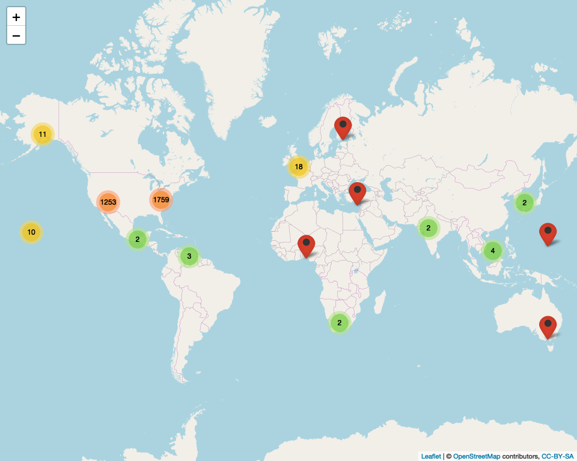

Petition\_Signers
================
Chris LeBoa
4/8/2020

## People who want SNAP Expanded to Online/ Mobile Orders

This is map of all the signers of the Change. Org petition on expanding
snap benefits to include online orders.

This code adds lat and long to each address. It takes forever to run and
costs $ so only uncomment if you really want it rerun

\#add comments to the signatures

    ## Parsed with column specification:
    ## cols(
    ##   name = col_character(),
    ##   city = col_character(),
    ##   state = col_character(),
    ##   `postal code` = col_character(),
    ##   country = col_character(),
    ##   `signed on` = col_character(),
    ##   postal_code = col_double(),
    ##   address = col_character(),
    ##   lon = col_double(),
    ##   lat = col_double(),
    ##   `commented date` = col_character(),
    ##   comment = col_character()
    ## )

    ## Input to asJSON(keep_vec_names=TRUE) is a named vector. In a future version of jsonlite, this option will not be supported, and named vectors will be translated into arrays instead of objects. If you want JSON object output, please use a named list instead. See ?toJSON.

<!-- -->
